# Fulcrum studio design review — 2026-08-27

Six reviewers drove the live app at 1536×830 and 2560×1600 across the M1 Color & Mood flow, the M2 images
prototype (overview, focused asset, credit modal, error states), the blocked M2 project, the world picker, and
the persistent chrome. 96 raw findings, deduped to 42 below. Every claim here was re-verified against the
screenshot it cites.

## Verdict

The visual language is strong and unusually consistent in tone: cream paper, hard black borders, offset
shadows, a single teal accent. Individual screens look composed. What is missing is everything underneath the
skin — state, hierarchy, and a shared token set. The product currently looks the same whether it is loading,
working, waiting on you, or dead in the water on a paid request, and the components that carry the most
important information are the smallest and faintest on screen.

Three themes account for most of the list:

**1. State is invisible.** The stage rail is on 100% of screens, sits at 2.82:1 contrast, and renders all five
stages identically — a blocked stage looks exactly like an approved one. The header buries the project's status
as a lowercase machine slug inside a teal routing strip. There is no alert colour anywhere in the product, so
failure is styled like success. On boot the app confidently renders a create-world form and "No worlds yet"
while your project is still fetching.

**2. Text where pictures belong.** The Color & Mood screen is a "style bible" whose only visual content is three
flat rectangles; lighting, atmosphere, materials, texture and shape language are all label/value text rows. The
focused asset screen gives a 940px prompt textarea more weight than the reference grid. Credits are presented as
10px mono arithmetic (`20 USED + 20 RESERVED / 100 CREDITS`) and never totalled against the plan the user is
about to approve. Raw prompt scaffolding and model instructions leak into user-facing copy.

**3. Two design systems, and a layout that gets worse as the screen gets bigger.** The shell and the M2
prototype disagree on the primary button (six token mismatches), the focus ring (one is a 1.9:1 ghost), the type
scale (ten sizes, four families), the hairline, the card surface and the secondary grey. Separately, 2560 is not
designed for: cards get *narrower* than at 1536, headings wrap *more*, panels stretch into 400–700px voids, and
hotbar tiles inflate to 500px around 130px of content.

Nothing in the list argues for a restyle. Most of it is one component fixed properly — the stage rail, the
header plaque, the credit meter, the card grid — plus one pass to unify tokens between the shell and the
prototype.

Counts: **18 high · 19 medium · 5 low.**

---

# High

## 1. The stage rail carries no state and is the lowest-contrast element in the product

Every `.vx-slot` renders its text at `rgba(22,22,29,0.45)` over `rgba(229,223,205,0.5)`, measured 2.82–2.91:1 at
10–11.5px, well under the 4.5:1 AA floor. The tiles are hard-coded `disabled`, and `.vx-slot:disabled` is
declared after `.vx-slot[data-active="true"]` in `m1-prototype.css`, so the disabled rule wins and strips the
active state's paper fill and teal ring. The result below: PITCH/BRIEF/COLOR & MOOD are done, IMAGES is
approved, ASSETS is **Blocked**, and all five tiles are byte-identical grey. On this project no slot is marked
current at all. This bar is on every screen in the product and it is the app's only progress model.
**Fix:** drive `disabled` from `slot.locked` instead of hard-coding it (or reorder the CSS so `[data-active]`
beats `:disabled`), raise resting label colour to ≥`rgba(22,22,29,0.72)` on an opaque fill, and ship three
unmistakable tiers — done (ink label + filled cube), current (paper fill + ink border + teal ring, styling that
already exists), locked (dashed, dimmed) — plus a fourth alert tone for blocked.

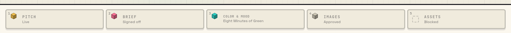

## 2. Failure has no colour — a blocked project looks exactly like a healthy one

The "PROJECT BLOCKED" eyebrow is `#0D8B81`, the same teal used for `LIVE` and the routing metadata beside it. In
the header, the word `blocked` is that same teal, lowercase, sandwiched between `LIVE` and `ORCH`, so the single
most alarming fact in the app is styled as one more routing chip. In the rail, ASSETS/Blocked gets the dashed
empty-slot glyph — the same icon an unstarted stage gets. Scanning this screen gives no colour or shape cue that
anything went wrong. The palette already carries an amber (`#F2C14E`) and a pink/red (`#FF7396`) on the stage
cubes, so an alert tone exists and simply is not applied.
**Fix:** define one alert colour and apply it in all three places: the card eyebrow and border accent, the header
status token (uppercase "BLOCKED" in alert, not lowercase teal), and the ASSETS rail slot.

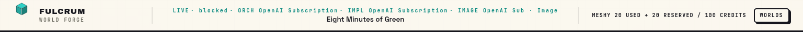

## 3. On boot and reload the app shows a confident wrong state

Opening a project URL renders a fully composed but false screen: header reads "WORLD SLOT 01 / Untitled world",
the credits chip is gone, the rail shows the empty ladder, and the stage shows the marketing hero with a live,
enabled **Create world** button and a right rail reading "RESUME A WORLD — No worlds yet / Create one on the
left." Measured settle times ranged from 2.3s (the `/api/projects` payload is 3.3MB) to 29s. There is no
skeleton, spinner or dimming. The copy actively contradicts itself: the hero promises "Reload this page mid-flow
and you land exactly where the project is" while the panel beside it says you have no worlds. A user reloading a
blocked, credit-reserving project is the exact user most likely to panic here.
**Fix:** when a `project` param is present, suppress the new-world hero entirely and render a restoring state —
skeleton bars in the header plaque and rail, a quiet centred "Restoring…" on the stage. Never render "No worlds
yet" until the project list has resolved. Fetching the single requested project instead of listing all 63 would
remove most of the wait.

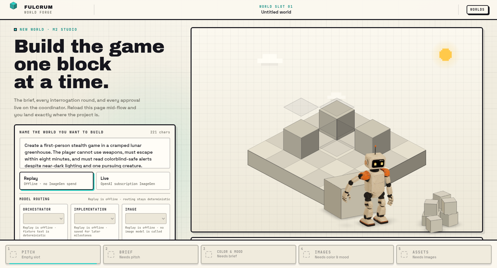

## 4. The blocked card's headline is `submission-unknown`, and it never mentions the 20 reserved credits

The H1 on a money-at-risk screen is the literal internal reason code, set in 26px display type — the largest
thing on the page. The only human sentence is demoted to 14px grey. And that sentence is the entire content: the
card never says which asset, when it happened, that 20 Meshy credits are reserved against this exact failure,
whether they are refunded or forfeited, what **Resume project** will actually do (re-check? re-submit? spend
again?), or where the user could verify the job themselves. The only credit information anywhere is the 10px
header string, which the card makes no reference to. The card is over half empty, so this is not a space
constraint.
**Fix:** promote a plain sentence to the H1 ("We don't know if your paid asset request went through") and demote
`submission-unknown` to a mono code chip beside the eyebrow. Fill the body with the deciding facts: asset name,
timestamp, an explicit "20 credits are reserved and will be released / consumed if…" line, and one sentence on
what Resume does before it does it. Pair Resume with a lower-emphasis secondary action so the only affordance is
not the one that might spend money twice.

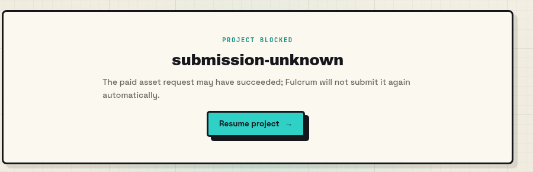

## 5. Per-asset credit costs never add up, and the visible plan already exceeds the balance

The header states `MESHY 20 USED + 20 RESERVED / 100 CREDITS`, so 60 credits are uncommitted. Every one of the
eleven asset cards carries a `30 CR` badge: the four image-path assets alone are 120 CR, and resolving all
eleven is 330 CR, against 60 remaining. The page shows the per-item price and the global balance but never the
sum, and never warns. The one number that decides whether this plan is affordable is the number the page refuses
to compute. The `30 CR` badges are also set in `--agp-muted`, the lightest text on the card, so the money signal
carries the least visual weight on screen.
**Fix:** put a running total next to the progress indicator ("330 CR to resolve all assets · 60 remaining") and
turn it amber/red when the plan exceeds the balance. Darken the per-card credit badge to at least the title's
ink. Replace the header string with a compact segmented meter (solid = used, hatched = reserved, remainder)
labelled "60 credits left", shifting to amber past 75% and red past 90%, and use the same component on the world
cards.

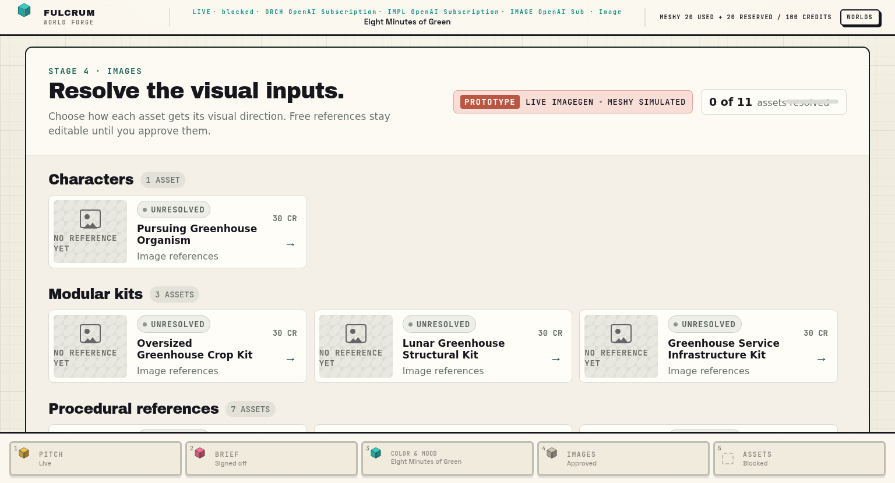

## 6. The progress meter is painted on top of its own label

In the overview header chip the 90px track sits directly over the word "resolved", reading as a strikethrough:
"0 of 11 assets ~~resolved~~". The cause is `.agp-progress { grid-template-columns: minmax(0,1fr) 90px }` with a
`nowrap` label that overflows its 1fr track. At 2560 it does not overlap but butts against the final `d` with
zero gap. The focused-asset page renders the same chip correctly, which confirms this is a missing
min-width/gap on the overview variant, not intent. It is the first thing the eye lands on in the head row, and
it looks broken.
**Fix:** `display:flex; gap:12px` with the track as `flex: 0 0 96px`, so the bar can never reflow under the text.
At 0% the empty track adds nothing — consider hiding it until at least one asset resolves.

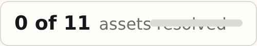

## 7. Failed reference slots draw the error on top of the still-visible empty text

When generation fails, `.agp-slot-error` is painted over `.agp-slot-empty` rather than replacing it. In every
failed tile you can read "WAITING FOR FRONT" ghosting through "Failed to fetch", and the plus-circle glyph shows
through "FRONT FAILED". Four tiles of overlapping strings makes the most stressful state in the flow look like a
rendering fault rather than an explanation. Reproduced by blocking `/api/prototype/imagegen/**`.
**Fix:** render exactly one slot state at a time (empty | pending | error | filled) instead of layering an
overlay on the empty state. Give the error tile its own composition: one error mark, one headline, one inline
retry.

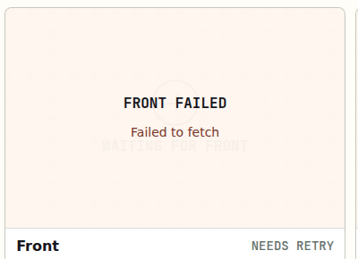

## 8. The disabled primary CTA is illegible and never says what is missing

The disabled state is the full amber button at `opacity: 0.44`, compositing to roughly `rgb(155,149,136)` on
`rgb(244,220,172)` — about 2.2:1. The "30 CREDITS" chip disappears entirely. This is the largest element in the
footer, so the loudest thing on screen is unreadable. The status line beside it ("Nothing is sent until you
acknowledge the credits.") never explains the actual blocker, which is that 0 of 4 views are ready. The
procedural variant has the same problem in teal.
**Fix:** style disabled explicitly — flat neutral fill, solid label at ≥4.5:1 — instead of dropping opacity on
the enabled skin, and replace the static footer sentence with the live blocker ("Needs 4 of 4 views — 0 ready").

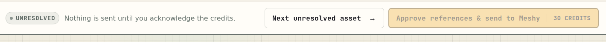

## 9. WORLDS tears down the loaded project instead of opening a picker

Clicking WORLDS does not open an overlay. It unmounts the studio and replaces it with the new-world landing
page: the header reverts to "WORLD SLOT 01 / Untitled world", the credits chip disappears, the rail resets to
the empty ladder. There is no fixed-position dialog in the DOM after the click, and no close, back or Escape
path. The world list you actually wanted is a secondary panel in the right column, below a ~460px robot
illustration and roughly 600px below the fold at 1536, so on a laptop the click appears to do nothing. On M1 a
second failure mode compounds it: an in-flight snapshot refresh re-applies the project ~1.5s later and the app
snaps back to where you were, reproducible on every attempt. The only global navigation control in the product
therefore reads as destructive, broken, or both.
**Fix:** make WORLDS a real overlay — centred sheet or right drawer, scrim, X, Escape — so the project
underneath is never unmounted. Lead with the world list; demote "create new" to a button in the sheet header.
Keep the marketing hero for genuine cold start only. Guard the poll result against a null current project so
`goHome` cannot be undone by an in-flight refresh.

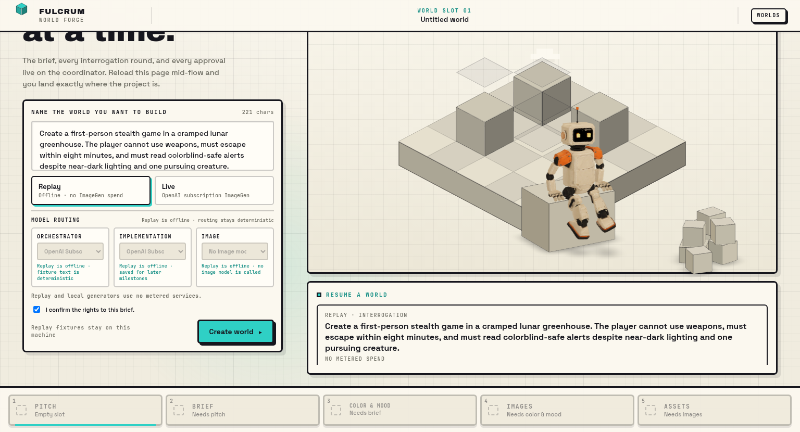

## 10. The world list is capped at 240px and shows one world out of nine

`.vx-project-list` sets `max-height: 240px; overflow: hidden`, and the inner `ul` never resolves a height, so its
`overflow: auto` yields a 116px scroller at 1536 holding 9 worlds (scrollHeight 869px). Measured visible cards at
1536: one. Cards are clipped mid-text at both edges, there is no visible scrollbar, no fade mask and no count, so
nothing signals that more exist. At 2560, with ~1300px of unused vertical space on the page, the panel is still
frozen at 240px. The cards themselves are not scannable either: several share the title "The Last Meridian" with
no date or id, the replay entry uses a three-line brief paragraph as its title so card heights swing 83–125px,
and there is no marker for the world you came from.
**Fix:** drop the fixed max-height and let the list fill the column (`min-height:0; flex:1` or a `dvh` clamp)
with a real scrollbar. Uniform card height, title clamped to one line, a created/updated timestamp as the
disambiguator, and a "Current" badge on the world you navigated from.

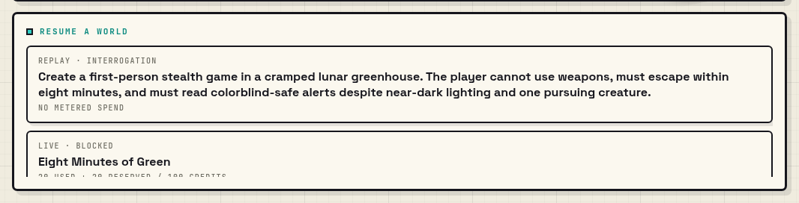

## 11. The header puts routing config above the project name and hides the status inside it

The plaque stacks a 10px/700 teal mono run on line 1 — `LIVE· blocked· ORCH OpenAI Subscription· IMPL OpenAI
Subscription· IMAGE OpenAI Sub · Image` — with the world's actual name ("Eight Minutes of Green", 13.5px) on line
2. Identity is subordinated to settings that never change during a session: "OpenAI" appears four times across
~740px at 2560. Because the run is undifferentiated, `blocked` — the most important fact about this project —
reads exactly like `ORCH OpenAI Subscription`. Three copy defects ride along: the state is the raw enum
(`visual-direction-approval` on M1), the middot separator collides with a separator inside a value (`IMAGE
OpenAI Sub · Image` parses as two fields with a stray trailing "Image"), and separators hug the preceding token
with no leading space. The red guide below marks the true viewport centre.
**Fix:** invert it. World name first at 16–18px ink; a status pill beside it carrying its own tone (teal running,
amber needs you, alert blocked) with the enum mapped to a written label through one shared formatter used by the
header, rail and world cards. Collapse the three routes into one quiet chip ("OpenAI · all routes") that expands
on hover, and only expand inline when they differ.

## 12. The prompt textarea swallows the image screen, and its sibling panel stretches into a void

At 1536 the compose panel is 543×1334 against a 815×748 reference panel — a 586px mismatch that leaves the whole
right side blank below the grid. The textarea is 501×940 and auto-grows to fit an unbroken ~1,800-character
prompt, so the thing the user is meant to read gets 37% of the width while empty placeholder tiles get 55%. On
the direct-text path the same stretch produces the worst artefact in the flow: the dark `OUTPUT ROUTE / Meshy 6`
card holds one label, one heading and two lines of copy but is stretched to the prompt's height, leaving roughly
400px of solid `#12211D`. Because it is the darkest surface on a cream page, the empty area is the
highest-contrast shape on screen and pulls the eye to nothing.
**Fix:** cap the textarea at 10–12 visible lines with internal scroll (or collapse it to a summary plus "Edit
prompt") and let the reference grid be the dominant column. Give the output-route card `align-self: start` so it
hugs its content, or convert it to a compact horizontal summary bar above the prompt.

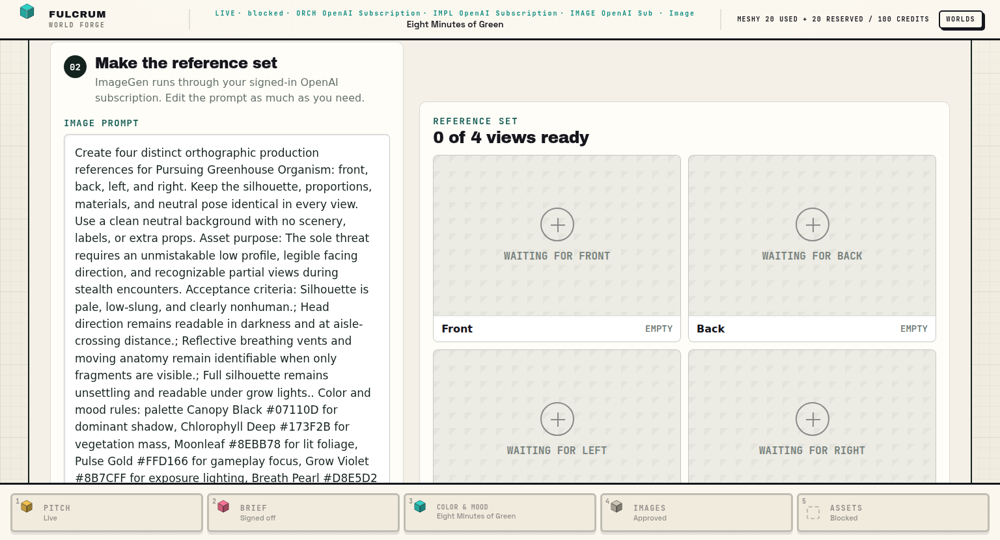

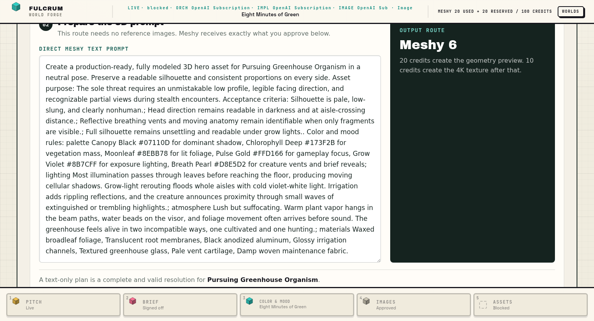

## 13. The three M1 directions are roughly half byte-identical, and the copy leaks model instructions

Full-page text diffs of Luminous Folkcraft, Monumental Ink and Weathered Storybook: CAMERA, COMPOSITION, all six
Readability rules and all three Avoid items are character-for-character identical, as are four of the five
sentences in the description. Only the first sentence plus palette, lighting, atmosphere, materials, texture and
shape language actually change. At 1536 the constant blocks occupy the second and third screenfuls, so the user
reads two screens of boilerplate to find seven differing lines on the app's single most important comparison
screen. The shared text is also raw scaffolding: "Player fantasy: Name one observable accomplishment that
expresses the brief's central fantasy" is an instruction to the model, shown verbatim on all three directions,
and the constraint sentences reappear as Readability bullets including one that is literally "first-person." —
a two-word fragment in a list beside "Preserve the dominant silhouette at thumbnail size."
**Fix:** split the card into "what makes this direction different" (the six fields that vary) and a single
shared "Rules that apply to every direction" block rendered once, outside the tabs. Filter instruction
sentences out of the rendered description, drop the constraint text that already exists as bullets, and discard
rule fragments shorter than a clause.

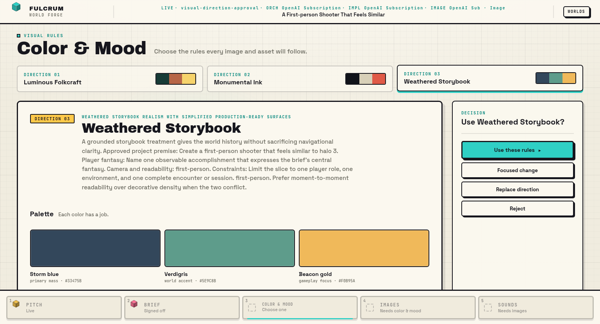

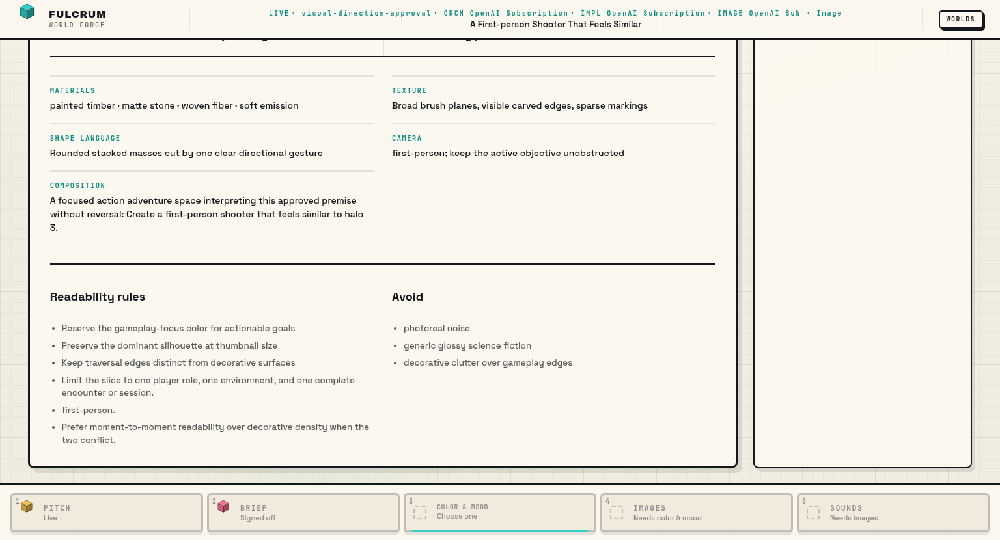

## 14. The style bible has no visuals, and its decision rail is a mostly-empty column whose CTA scrolls away

Everything on Color & Mood except three flat rectangles is prose. Lighting, atmosphere, materials, texture,
shape language, camera and composition — the fields that define how the world will look — are label/value text
rows. Even the palette communicates only hue: the swatches are equal-sized, so the fact that Deep pine is the
"primary mass" and Lantern the "gameplay focus" is carried by 10px grey text rather than by the visual. Choosing
between three visual directions is a reading task. Beside it, the DECISION card is stretched to the content
card's full height: at 2560 the four buttons end around y=430 and the panel continues empty to y≈1130, roughly
700px of blank — the largest single area on screen. At 1536 the inverse hurts more: the buttons sit in the first
screenful, so by the time you have read the rules on screens 2 and 3, "Use these rules" is nowhere on screen and
the right column is a blank 380px box.
**Fix:** encode the rules visually — size swatches by intended coverage so dominance is readable without text,
derive a small gradient swatch for lighting/atmosphere from the palette, render materials as tinted chips, and
draw shape language as a three-silhouette diagram. Let the decision card be `height: fit-content` and sticky (or
a compact action bar at the bottom of the content column) so the CTA stays reachable while reading.

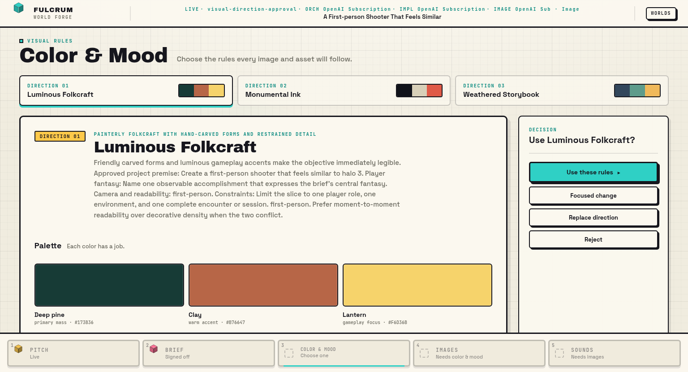

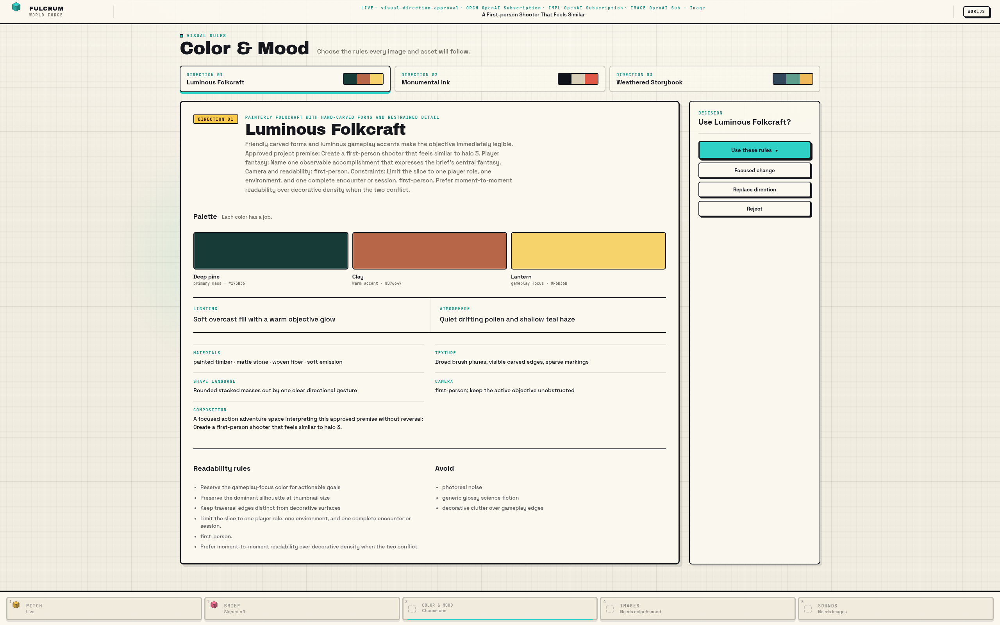

## 15. The shell and the prototype are two different design systems

The primary button diverges on six tokens: M1's `.vx-primary` is Fulcrum Text 14px/700, fill `rgb(47,208,197)`,
3px `#16161D` border, 5px radius, 4px offset shadow; the prototype's `.agp-primary` is Fulcrum Mono 16px/700,
fill `rgb(119,212,198)` (a visibly duller teal), 2px `rgb(21,35,31)` border (a different near-black), 7px radius,
3px shadow. The same split runs through the hairline (`rgba(22,22,29,0.22)` vs `rgba(21,35,31,0.16)`), the card
surface (`#FFFDF7` vs `#FFFDF8`, with the prompt textarea at pure white, which reads cold against the cream),
the secondary grey (warm `rgb(109,108,98)` vs cool `rgb(101,113,108)`), and the type scale — ten sizes and four
families, with body copy simultaneously at 13.5, 15, 16 and 17px, and a fourth family (Fulcrum Sans) introduced
for prototype body text. Focus is the worst case: the shell draws `2px solid rgb(13,139,129)` at 2px offset
(≈3.9:1), the prototype draws `3px solid rgba(20,112,98,0.42)` which composites to ≈1.9:1 and fails the WCAG 2.2
3:1 minimum, and M1's textarea sets `outline: none` and fakes a ring with a box-shadow. On the blocked screen
the ring on **Resume project** is `#0D8B81` drawn directly on the `#2FD0C5` fill: 2.18:1, effectively invisible
on the second tab stop of a credit-spending action.
**Fix:** promote one spec per role to shared tokens — primary button, hairline, card surface, ink, secondary
grey — and have the prototype consume them. Collapse to a five-step type scale with one family per role and one
body size. One global `:focus-visible` rule (`2px solid rgb(13,139,129); outline-offset: 2px`, no alpha), and on
filled buttons use an offset ink ring so it lands on the paper rather than on the fill.

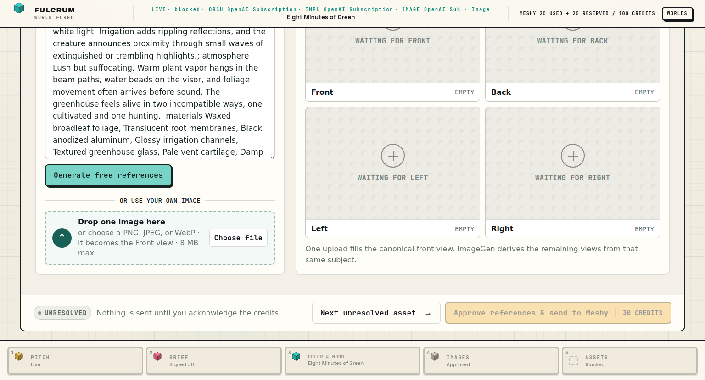

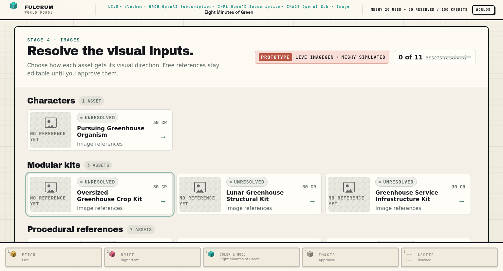

## 16. The 2560 display gets the worse layout

At 1536 the inventory is 3 columns of 444px cards. At 2560 a `min-width: 2200px` query flips to 4 columns of
371px inside a container that only grows to 1636px: bigger screen, smaller card. The text column drops from
216px to 143px, so titles wrap to four lines and every subtitle truncates. The h1 "Resolve the visual inputs."
fits one line at 1536 and wraps to two at 2560 because the type scales with the viewport while its container
does not. Below the grid, ~400px of empty paper sits inside the bordered panel plus a permanently empty fourth
column, while the same list at 1536 is clipped after 1.7 rows. The pattern repeats elsewhere: the M1 decision
rail stretches into ~700px of void, the blocked card floats in an empty 2560×1450 canvas, and rail tiles inflate
to 501px around ~130px of left-hugging content.
**Fix:** gate the 4-column rule on container width (a container query on `.agp-inventory`) rather than viewport
width, and let the inventory container widen before adding a column. Cap the content column around 1440px and
centre it, let stretched panels be `fit-content`, and tie the h1 measure to a `ch`-based max-width so it wraps
identically at both sizes.

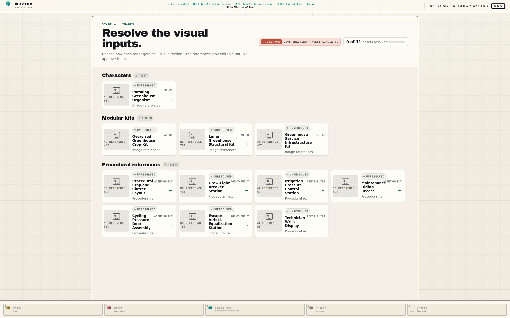

## 17. "AGENT-BUILT" collides with the card title at 2560

`.agp-node-meta` is an `auto` column pinned to the title's right with a 17px gap and vertically centred while the
title is not. Once the title wraps to three or more lines the two overlap: "Maintenance Hiding Recess" renders
underneath "AGENT-BUILT", and on the others the badge sits inside the title's line box so the card reads
"Procedural AGENT-BUILT / Crop and / Clutter / Layout". The badge also steals ~90px from an already 143px title
column, which is what forces the four-line wrap in the first place. On the same cards the path label truncates to
"Procedural re…" with hundreds of spare pixels to its right.
**Fix:** make the card body an explicit `grid-template-columns: 1fr auto` so the title can never run under the
meta, move the credit cost and path label into the pill row where there is room, and drop the truncation.

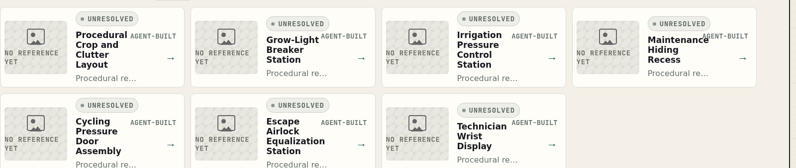

## 18. The blocked card is 293px off-centre in an otherwise empty canvas

`.voxel-concept-host` is a fixed-width column sized for the normal three-up concept view, and the blocked state
renders one card inside it. At 2560 the host is x=460, w=1054, centre 987 against a viewport centre of 1280 —
293px left, with 1046px of empty grid to its right. At 1536 the offset is the same 293px. A 259px card in a
1450px stage, off-axis, reads as a rendering mistake rather than a composition. Inside the card the alignment is
mixed: the block is `text-align: center` but the paragraph resolves to left, so its second line ("automatically.")
sits alone against the left edge of a centred block, ~110px left of the H1's left edge with ~350px of white to
its right, between a perfectly centred heading and a perfectly centred button.
**Fix:** drop the concept-grid host in the blocked state and centre the card in the stage at a 640–720px
max-width. Pick one axis inside it: centre everything with the paragraph capped at ~46ch so it breaks into
balanced lines, or left-align the whole stack against a single edge.

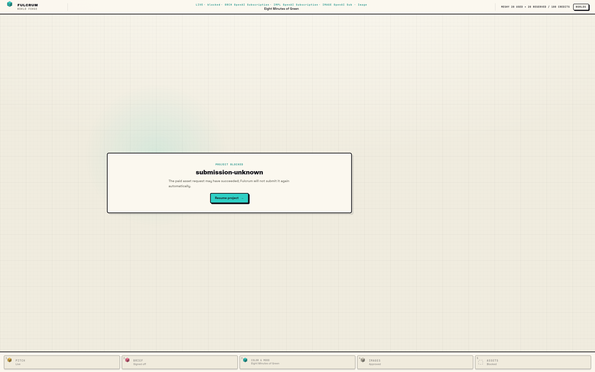

---

# Medium

## 19. Rail tiles inflate to ~500px around 130px of content at 2560

The five slots divide the full width equally: 501px each at 2560, 296px at 1536. The numeral, 17px cube, 11.5px
label and 11px status are all left-aligned and occupy roughly the first 130px, leaving ~370px empty per tile,
five times over. Content also sits toward the top of a 60px slot rather than optically centred. With the flat
disabled styling and the rounded border, each tile reads as an empty text input rather than a step in a rail.
The bar costs 88px, which with the 62px header is 18% of an 830px laptop viewport for fifteen short strings.
**Fix:** cap tile width (~340px) and centre the group at wide viewports, or use the width structurally — label
left, status right-aligned within the tile. Consider a ~48px numbered-chip rail on screens where the stage is
not the one being worked in.

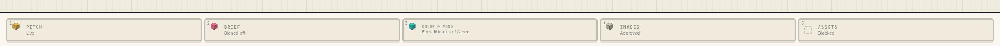

## 20. The teal micro-caps used for every kicker measure 3.93:1

`rgb(13,139,129)` on the cream ground is 3.93:1, used at 10–10.5px with 2px tracking for the header routing
strip, "WORLD SLOT 01", "PROJECT BLOCKED", "STAGE 4 · IMAGES", "VISUAL RULES", "RESUME A WORLD", "DECISION" and
every field kicker in the M1 direction card. Small text needs 4.5:1, and this is the smallest text in the
product; the tight tracking makes it read worse than the number suggests. These labels carry the entire
structure of every page.
**Fix:** split into two tokens. `--accent-text` at roughly `#0A6F67` (≈5.2:1 on cream) for anything under 14px,
and keep `rgb(47,208,197)` as `--accent-fill` for fills and underlines only.

## 21. The "centred" header plaque is not centred and jumps 155px between projects

The plaque is a flex-fill between the brand block and the session block, so its centre is the midpoint of
whatever is left over. At 1536 on M2 (credits chip present, session block 378px) the plaque centre is x=699,
69px left of the 768px viewport centre; on M1 (no credits chip, session block collapses to 68px) it is x=854,
86px right. Same component, opposite sides of the axis, a 155px swing purely because M1 has no Meshy credits.
The collapsed session block also leaves a conspicuous dead gap before the WORLDS divider on M1.
**Fix:** three-column grid with equal fixed rails (`minmax(280px,1fr) auto minmax(280px,1fr)`) so the plaque is
optically centred regardless of the sides, or left-align it against the brand divider, which also closes the M1
gap.

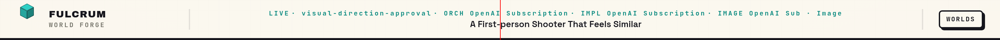

## 22. The header truncates the spend-relevant route first, and mid-word

The strip already overflows at 1440 (scrollWidth 738 vs clientWidth 678), 96px narrower than Zach's laptop. At
1366 it renders "…IMPL OpenAI Subscription· IMAGE …"; at 1180 the IMPL span is hidden by a media rule and the
remainder ellipsizes mid-token as "IMAGE Ope…". The field describing what actually costs money is sacrificed
first while "ORCH OpenAI Subscription", the least actionable item, survives at every width. There is no tooltip
or expand affordance, so the information is simply gone. The Meshy credits block beside it holds a fixed 378px
throughout.
**Fix:** give the strip an explicit priority order (status > image provider > orchestrator > implementation),
collapse low-priority fields to acronyms or an overflow chip, truncate at field boundaries only, and surface the
full routing in a popover.

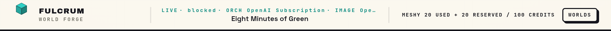

## 23. The inventory is a nested scroller with a hard clip, and its group headers scroll away

`.agp-inventory` scrolls 491px of a 948px list inside `.vx-stage`, which itself scrolls 680 of 716. Wheeling
scrolls the inner list then silently hands off to the outer stage. Content passes under the header divider with
a hard cut that slices status pills in half, with `mask-image: none` and no visible scrollbar thumb. At 1536 the
190px header block leaves ~1.7 card rows visible, so most of an 11-asset inventory hides behind an interaction
the page never signals. Scrolled to the bottom, the group headings — the page's main organising idea, and with
eleven near-identical cards the only thing distinguishing one card from another — are gone entirely rather than
pinned.
**Fix:** make the stage the single scroller, or make the header sticky/compact so the inventory owns the frame.
Pin `.agp-group > header` to the top of the scroller with the paper background and existing hairline, add a
bottom fade mask and a visible scrollbar. Compressing the header buys back a full card row at 1536.

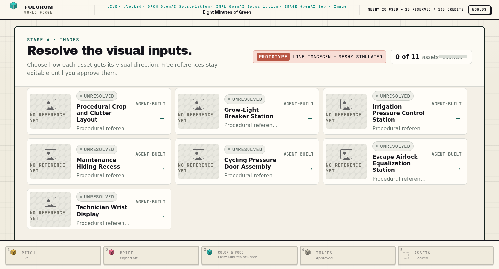

## 24. Each card says "unresolved" three times and truncates the one line that differs

Every node carries "NO REFERENCE YET" in the thumbnail, an "UNRESOLVED" pill, and a subtitle, three signals for
one fact within 100px of each other, repeated eleven times when the header already says "0 of 11 resolved".
Meanwhile the subtitle is `nowrap` + ellipsis in a narrow column, so "Procedural reference" truncates to
"Procedural refen…" — and that string is a near-verbatim repeat of the group heading it sits under. The one
truncated line carries the least new information; the field that actually differs per card (image references vs
agent-built) is the palest text on it. The thumbnail caption is also `#75817b` on an `#e9e8e0` checkerboard,
3.3:1 at 14px bold.
**Fix:** drop the thumbnail caption (the placeholder already reads as empty), drop the path subtitle where the
group heading states it, and surface the status pill only on exceptions (in progress, ready, failed). Promote
the path label into the pill slot as a typed chip so scanning the grid answers "what happens to this asset" in
one pass.

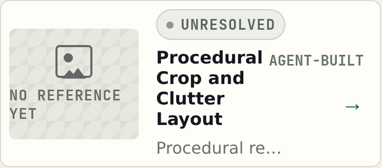

## 25. Card content is centre-aligned, so pills and subtitles drift across a row

`.agp-asset-node` uses `align-items: center`, so in a row where one title wraps to three lines and its
neighbours wrap to two, the UNRESOLVED pills land at three different heights (~13px of drift across the Modular
kits row) and the subtitles do the same, while "30 CR" stays pinned. The row looks jittery rather than gridded,
which undercuts the pill's job as a scannable status column.
**Fix:** `align-items: start` with the copy as a top-aligned stack (pill → title → subtitle) and a reserved
two-line title height, so pills, titles and subtitles share baselines across a row.

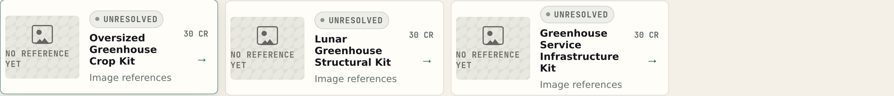

## 26. The error state shows twelve failure strings and gives retry the lesser emphasis

Each failed tile carries three separate failure strings ("FRONT FAILED", "Failed to fetch", "NEEDS RETRY"), so
one failed run produces twelve error messages and no summary. "Failed to fetch" is a raw browser exception
surfaced to the user. The recovery action, **Retry failed views**, is a plain white secondary button beside the
filled teal **Generate free references**, so in the exact state where retry is the obvious next step the wrong
action carries the visual weight.
**Fix:** one human line per tile ("Front didn't generate"), one summary above the grid ("4 of 4 views failed"),
and swap emphasis so retry becomes the filled primary and full regeneration drops to secondary.

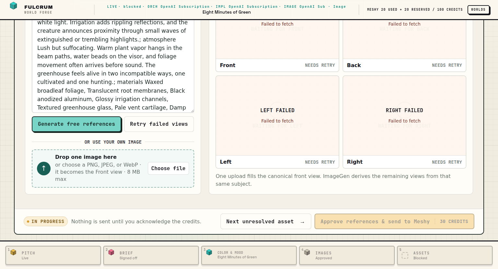

## 27. The footer status pill reads "IN PROGRESS" both when everything failed and when the set is ready

After all four generations fail the pill shows amber "IN PROGRESS" while every tile says NEEDS RETRY. After a
successful upload on the kit asset — 1 of 1 views ready, approve button enabled and fully legible — the pill
still says "IN PROGRESS". The one persistent status indicator on the page never distinguishes the two states a
user actually cares about: something is broken, versus this is ready to send.
**Fix:** distinct states with matching dot colour — Unresolved / Generating / Needs retry (alert) / Ready to
send / Resolved.

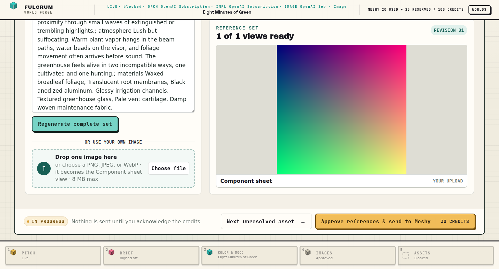

## 28. Nothing on the focused asset page has hover feedback except the back button

The stylesheet defines `:hover` only for `.agp-asset-node` and `.agp-back`. Hovering the unselected "Send text to
Meshy" path card produces a pixel-identical render; hovering "Next unresolved asset" leaves background, transform
and box-shadow unchanged. The same is true of "Generate free references", "Retry failed views", "Choose file",
the drop zone and the reference tiles. Two large clickable cards and four buttons all feel inert, which is the
main reason the path chooser does not read as interactive.
**Fix:** one shared hover token — subtle background lift plus 1px border darkening, ~120ms ease — applied to
`.agp-path-chooser button`, `.agp-primary`, `.agp-secondary`, `.agp-next`, `.agp-credit-button` and
`.agp-upload`, plus a pressed state on the path cards.

## 29. Path cards shift 11px on selection, and the unchosen option is the more colourful one

At 1536 the selected card's title sits at y=580 and the unselected at y=591, an 11px offset caused by selection
switching the border from 1px to 2px and shifting the content box. Both cards are the same 685×101, so the
misalignment is plainly visible side by side. Separately, the selected card's icon is grey line art on a
desaturated tile while the unselected card's is a literal "Aa" on a saturated mint tile, so the unchosen option
is the more colourful of the two and the icon set mixes a pictogram with a typographic sample.
**Fix:** keep the border width constant and express selection with colour or an inset ring so content never
shifts; redraw both icons in one style and give the selected tile the accent.

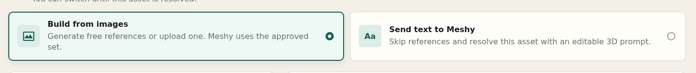

## 30. The credit modal is fixed at 570px, so the title orphans and the buttons are different heights

The box measures 570×704 at both 1536 and 2560. At that width the 31px title breaks as "Send Oversized /
Greenhouse Crop Kit to / Meshy?" with an orphaned "Meshy?", and "Acknowledge 30 credits & send" wraps to two
lines, making the confirm button 74px tall against a 52px "Keep editing". Two side-by-side actions at visibly
different heights is the sloppiest detail in the flow. Casing is inconsistent inside one panel: "30 credits" in
the summary row against "20 Credits" and "10 Credits" in the breakdown. At 1536 the 704px box spans y=63 to
y=767 in an 830px viewport.
**Fix:** widen to 640–720px or scale with viewport, drop the title to ~24px, force equal button heights with a
shared min-height, and pick one casing for "credits".

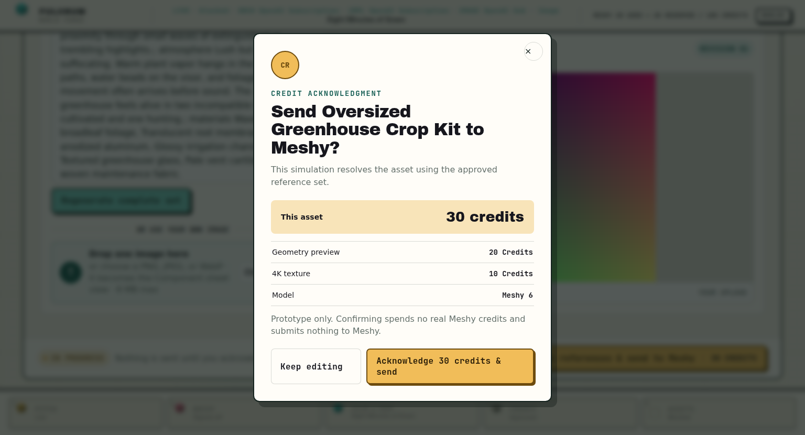

## 31. The text prompt has no validation, and the reassurance copy contradicts the disabled CTA

Typing "short" into the direct Meshy prompt leaves "Send text prompt to Meshy · 30 CREDITS" fully enabled with no
warning. Clearing the field disables the CTA but shows no placeholder, no error and no minimum — the 320px box is
simply blank — while the line beneath still reads "A text-only plan is a complete and valid resolution for
Pursuing Greenhouse Organism." The reassurance and the dead button contradict each other on a spend-committing
action.
**Fix:** add a placeholder and a live length/quality hint under the field, and swap the reassurance line for the
actual requirement when the prompt is too short.

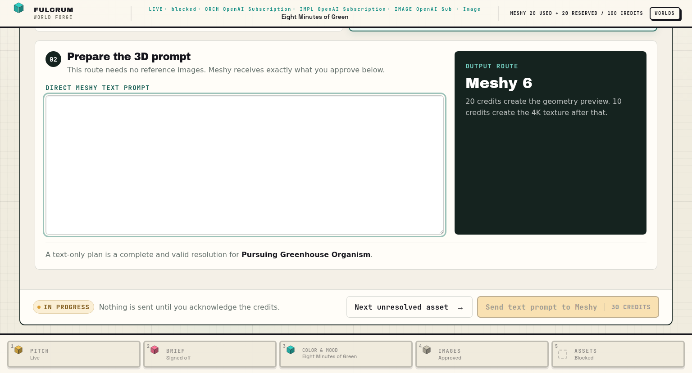

## 32. Single-view assets reuse the four-up grid, producing one ~770×400 empty tile

For a one-slot asset the reference panel renders a single tile stretched across the full grid width: a ~770×400
hatched rectangle whose only content is a plus circle and "WAITING FOR COMPONENT SHEET". It is the largest empty
area on the page and gives one missing image the same weight the hero gives to four. The heading also reads
"0 of 1 views ready" and later "1 of 1 views ready", a plural noun on a count of one in 23px display type.
**Fix:** constrain the single-slot tile to a sensible max-width (~420px) and align it in the panel rather than
stretching, and pluralise the count.

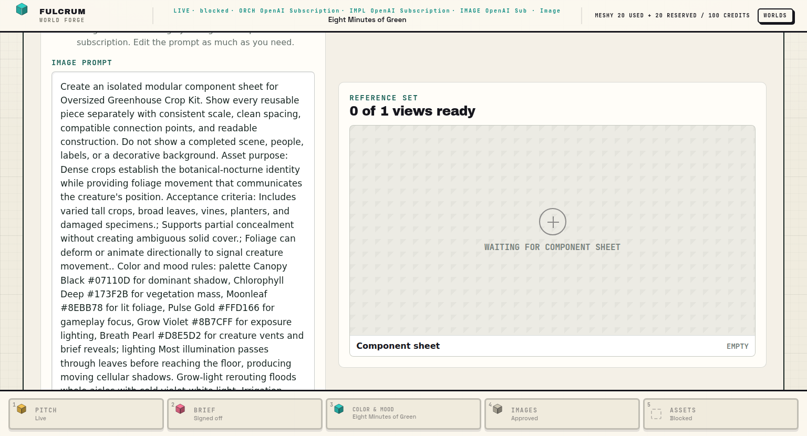

## 33. The asset brief's left column is 77% empty and its reason is outranked by the checklist

At 1536 the left column is 799×209 but its paragraph occupies 48px, leaving ~160px blank before the divider
(137px at 2560). The right column's four bullets fill the full height, so the eye reads "Done means" as the
primary content and the actual rationale — the thing that justifies the asset — as an afterthought floating in a
hole. This repeats on every asset page, so it is the first thing you see each time you drill in.
**Fix:** top-align both columns and let the block collapse to the taller column, or restructure as a single lead
sentence at full width with the checklist beneath.

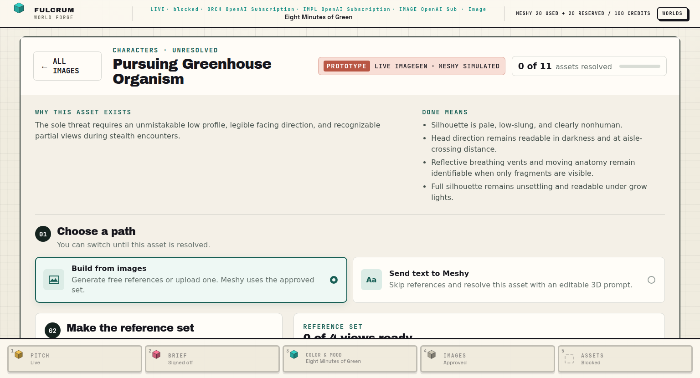

## 34. Opening a decision panel shoves the button you clicked ~290px down and pushes Reject off-screen

The change/replace/reject panels render above the action buttons, so opening one pushes the whole stack down. At
1536×830, "Use these rules" moves from y=384 to y=676 and "Replace direction" from y=465 to y=757, below the
rail that starts at ~y=755. "Focused change" ends up clipped at the viewport edge and "Reject" is entirely
off-screen. A disclosure control that jumps out from under the cursor and hides its siblings behind chrome, with
no scroll cue.
**Fix:** render the panel below the action stack (or replace the stack with the panel plus a Back affordance) so
the buttons keep their position, and scroll the revealed panel into view.

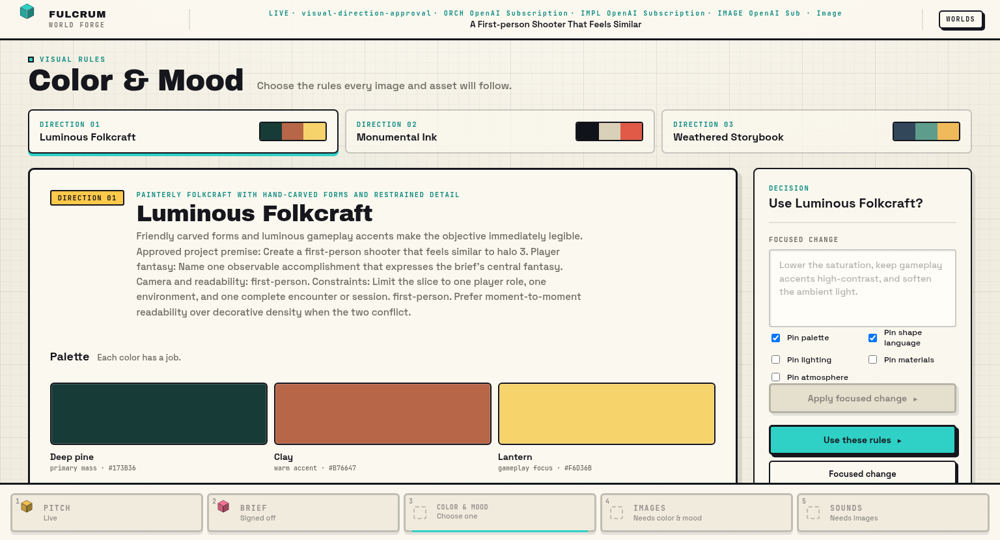

## 35. The Focused change panel drops out of the design system

The five "Pin palette / Pin shape language / …" controls are native browser checkboxes (13px, default OS blue)
inside a cream/black/teal system where every other control has a 2px black border and a hard offset shadow. The
textarea uses a 2px `rgba(22,22,29,0.22)` border instead of the system's solid black, so it looks disabled. The
panel's eyebrow "FOCUSED CHANGE" is grey while the "DECISION" eyebrow 12px above it is teal, two treatments for
the same label role inside one card. The two-column checkbox grid also orphans "Pin atmosphere" on its own row
while "Pin shape language" wraps.
**Fix:** style the checkboxes as system toggles (2px black box, ink check, 16px target) or convert them to
selectable chips, which suit "pin these facets" better; give the textarea the standard border; make the eyebrow
teal; lay the pins out as one flowing chip row.

## 36. In the palette, the colour's job is the smallest, faintest text on the page

Each swatch is a 330×110 block with a caption: name in 14px bold ink, then "primary mass · #173B36" in 10px
`rgb(109,108,98)` mono. The role and the hex share one line at the same size and weight, so the semantic
information is visually equal to a debug string and both are the smallest type in the layout. The section
subtitle says "Each color has a job" and then hides the job. The palette consumes ~40% of the first screenful
while communicating less than a three-line legend would.
**Fix:** promote the role to 12–13px ink, demote the hex to a secondary or hover detail, reduce swatch height,
and vary swatch width by intended coverage so dominance reads without any text.

## 37. Hovering a direction tab looks almost exactly like selecting it, and selection changes row height

Idle tabs have a faint grey border. On hover a tab gains the full black 2px border and light fill, near-identical
to the selected tab, which differs only by a 2px teal underline. On the main comparison control of the flow, an
ambiguous hover/selected pair makes it genuinely unclear which direction is shown. The selected tab is also
taller than its siblings (top edges at y=166 vs y=170), so the row's top edge steps as selection moves.
**Fix:** reserve the black border plus teal underline for selected only, use a lighter hover (background tint or
1px border darkening plus a small lift), and reserve the selected state's extra height in all three tabs.

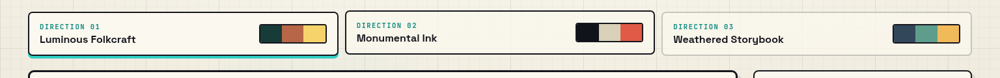

---

# Low

## 38. Empty slots carry three labels for one missing image, and the state chip is 3.37:1

Each empty tile says "WAITING FOR FRONT" in the visual, then "Front" and "EMPTY" in the caption bar: three
labels for the same absence, four times over on a hero asset. "EMPTY" is `rgb(119,129,124)` on `rgb(236,235,228)`
= 3.37:1 at 16px bold. The pending overlay is related: white on `rgba(12,37,32,0.54)` composites to ≈4.2:1 at
14px, and all four tiles show the identical string "Generating four-view sheet…".
**Fix:** one label per slot (caption plus state chip), darken the chip to ≥4.5:1, and make pending copy per-view.

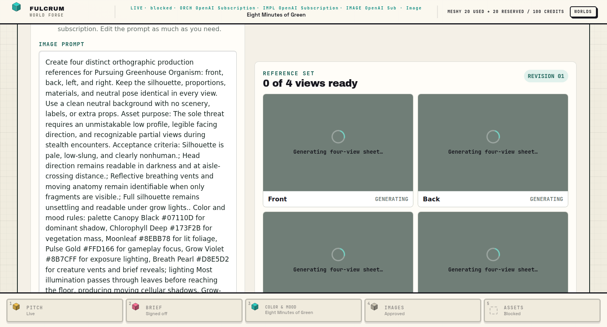

## 39. The back button is locked to 150×64 so "← ALL IMAGES" always wraps to two lines

`.agp-back` computes to a fixed 150px at both viewports, breaking the mono label as "← ALL / IMAGES". A two-word
back affordance rendered as a squat two-line box beside a 31px display title is first in the reading order and
immediately looks unresolved; the arrow also centres against the first line only.
**Fix:** size to content with `white-space: nowrap` and horizontal padding, or shorten the label to "All images".

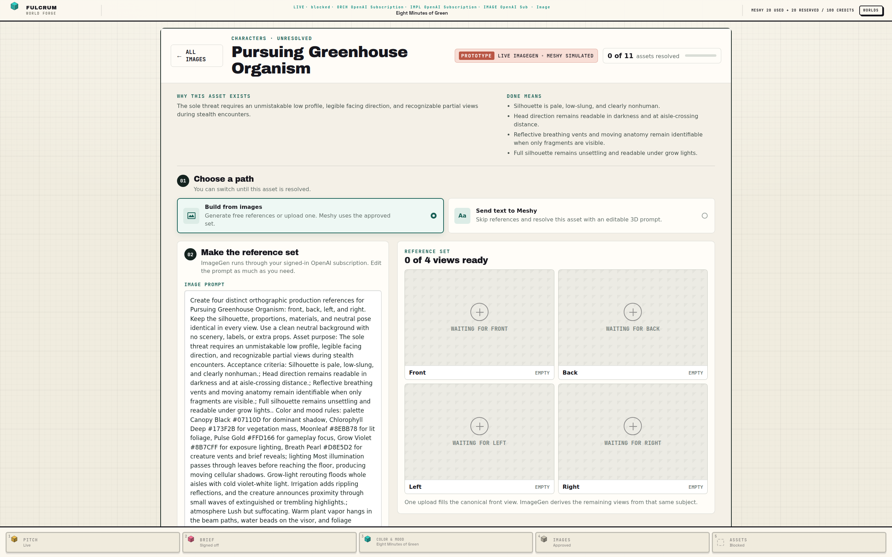

## 40. Closing the credit modal does not return focus to the trigger

Focus is correctly moved to the close button on open. After Escape the modal dismisses but focus falls back to
the document start, so the next Tab lands on the top-bar WORLDS link, then the back button. A keyboard user is
thrown to the top of the page and has to tab through the whole asset form to reach the CTA they just dismissed.
**Fix:** store the trigger element on open and call `.focus()` on it in the modal's cleanup, for both Escape and
"Keep editing".

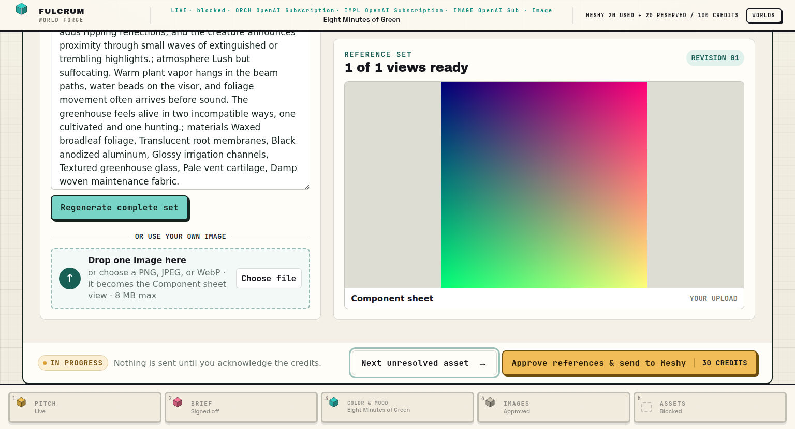

## 41. Rail status lines mix four vocabularies and echo the project name

Reading the M2 rail left to right: "Live" (the run mode, not a pitch status, duplicating the header's LIVE),
"Signed off", "Eight Minutes of Green" (the project name, verbatim what the header shows two inches above),
"Approved", "Blocked". M1's third slot instead says "Choose one", an instruction. One 60px row carries a mode,
two past-tense approvals, a proper noun, a failure state and an imperative in the same 11px grey. The icons do
not rescue it: four cubes in unrelated hues plus a dashed frame encode nothing, and on M1 the current stage
shows the same dashed empty frame as the two locked stages after it.
**Fix:** one grammar per state — past tense for done, present imperative for current, requirement for locked, a
distinct tone for blocked — and never echo the world name. Let the cube's fill, not its hue, carry
done-vs-pending, and give the current stage a filled cube.

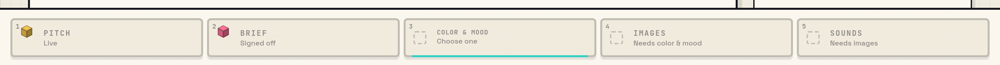

## 42. The card grid's right edge misses the header's right edge by the scrollbar gutter

`.agp-inventory` sets `scrollbar-gutter: stable`, reserving 15px the non-scrolling header above does not. The
card grid ends at x=1438 while the progress pill ends at x=1453, so the panel's strongest vertical alignment
line is broken by a hair-off amount, visible as the right column of cards sitting slightly inboard of everything
above.
**Fix:** apply the same reserve to `.agp-overview-head`, or move `scrollbar-gutter: stable` to a shared wrapper
so header and grid share one right edge.

